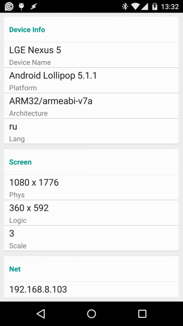
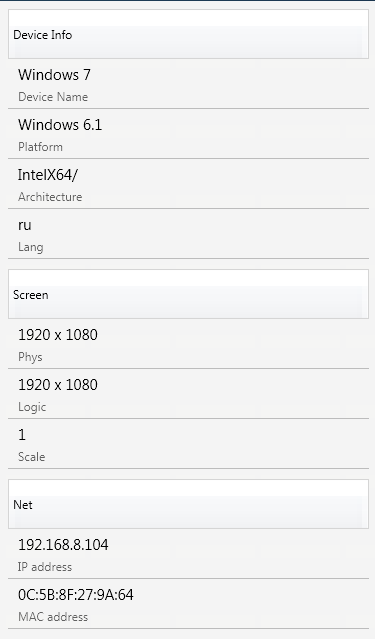
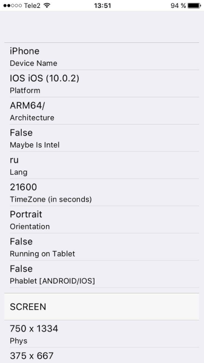
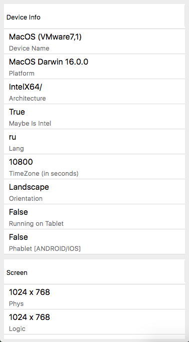

# FMX.DeviceInfo
[FireMonkey] Device Info [Windows/Mac/IOS/Android]

#### Note: Permissions for Android: access_network_state / acces_wifi_state / read_phone_state

```
// uses FMX.ZDeviceInfo;
var
  di: TZDeviceInfo;
begin
  Memo1.Lines.Clear;
  di := TZDeviceInfo.Create;
  try
    Memo1.Lines.Add('Platform: ' + di.Platform);
    Memo1.Lines.Add('PlatformVer: ' + di.PlatformVer);
    Memo1.Lines.Add('Architecture: ' + di.Architecture);
    Memo1.Lines.Add('Architecture2: ' + di.Architecture2);
    Memo1.Lines.Add('IsIntel: ' + di.IsIntel.ToString(TUseBoolStrs.True));
    Memo1.Lines.Add('Device: ' + di.Device);
    Memo1.Lines.Add('MacAddress: ' + di.MacAddress);
    Memo1.Lines.Add('IPAddress: ' + di.IPAddress);
    Memo1.Lines.Add('LangID: ' + di.LangID);
    Memo1.Lines.Add('ScreenPhis: ' + di.ScreenPhis);
    Memo1.Lines.Add('ScreenLogic: ' + di.ScreenLogic);
    Memo1.Lines.Add('Scale: ' + di.Scale.ToString);
    Memo1.Lines.Add('MobileOperator: ' + di.MobileOperator);
    Memo1.Lines.Add('TimeZone: ' + di.TimeZone.ToString);

    Memo1.Lines.Add('IsNetConnected: ' + di.IsNetConnected.ToString(TUseBoolStrs.True));
    Memo1.Lines.Add('NetworkConnectionType: ' + TZNetworkConnectionTypeString[di.NetworkConnectionType]);
    Memo1.Lines.Add('MobileDataType: ' + TZMobileDataTypeString[di.MobileDataType]);
  finally
    di.Free;
  end;
end;
```

 
 
